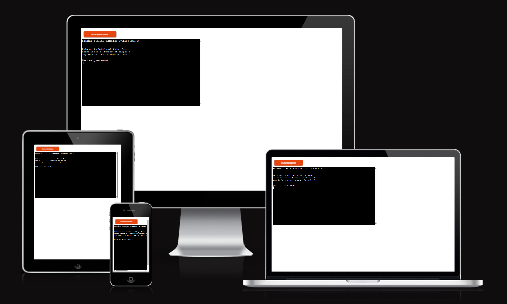
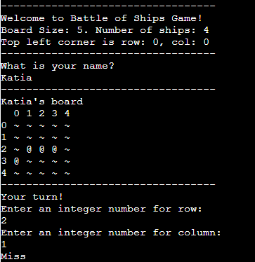
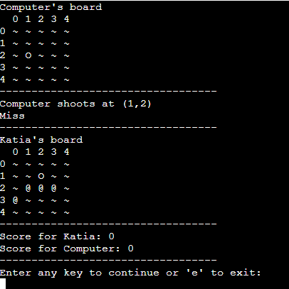
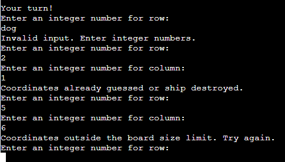

# Battleships Game
  
 Battleships Game is a Python terminal game that runs on the Code Institute mock terminal hosted on Heroku.
 The objective of the game is for the player to locate and destroy all the computer's ships before the computer finds and destroys the player's ships.

## How to play
In this version, after the user enters the name, their board is displayed with randomly positioned ships. Then he will be asked to enter the row and column coordinates respectively.

Ships on the player's board are symbolized by @.

Missed guesses are marked with O, and successful hits are marked with X.

Then the computer board appears, also with the ships randomly positioned, but hidden from the player.

The game alternates turns between the player and the computer, with each attempting to locate and destroy the opponent's ships.

The winner is the first to destroy all of the opponent's ships.

## Features

### Existing Features
- Random Board Generation
  - Ships are randomly positioned on both the player's and the computer's boards.
  - First appears the player board with its ships positioned randomly
 

- User Input
  - Players enter a name
  - Players enter row and column coordinates to guess the location of the computer’s ships.
  - The computer’s board is updated based on the player’s guesses, marking hits and misses.

- Computer's Turn
 - The computer takes turns guessing the player’s ship positions.
 - Display user's board

- Score Display
  - Scores are displayed after each round.

- Input Validation and Error-Checking
  - Prevents guesses outside the board's size.
  - Ensures only integers are accepted.
  - Disallows repeating the same guess.

- Data maintained in class instances

### Future Features
- Allow player to select the board size and number of ships

## Data Model
I used a Board class as my model.
The game creates two instances of the board class, the player's board and the computer's board.

The board class stores the size of the board, the number of ships, the positions of the ships, and the guesses made on the board.

The class also has some methods such as, display_board to display the boards, place-ship to position the ships randomly, register_shot to check whether any ship was hit or not and end_of_game, which checks whether the end of the game occurred, when all ships on one of the boards were hit.

## Testing

Manual Testing

The code was validated using the PEP8 Python Validator to ensure compliance with Python best practices.

Invalid inputs were tested, such as:

- Non-integer coordinates
- Repeated guesses
- Out-of-bound coordinates

### Bugs

  Solved Bugs
  - The coordinates where the ships were located on the board, from both the player and the 
    computer, were being accepted more than once. This was fixed by adding an appropriate if statement to check for duplicates.

### Remainning Bugs

- No bugs remaining

### Validator Testing

- PEP8

  -  No errors were returned from PEP8online.com

## Deployment

- This project was deployed using Code Institute's mock terminal for Heroku.

    - Steps for deployment:
      -  Fork or clone this repository
      -  Create a new Heroku app
      -  Set the buildbacks to Python and NodeJS in that order
      - Link the Heroku app to the repository
      - Click on Deploy

## Credits

- Code Institute: For providing the deployment terminal and the example of the Board class used as a reference.